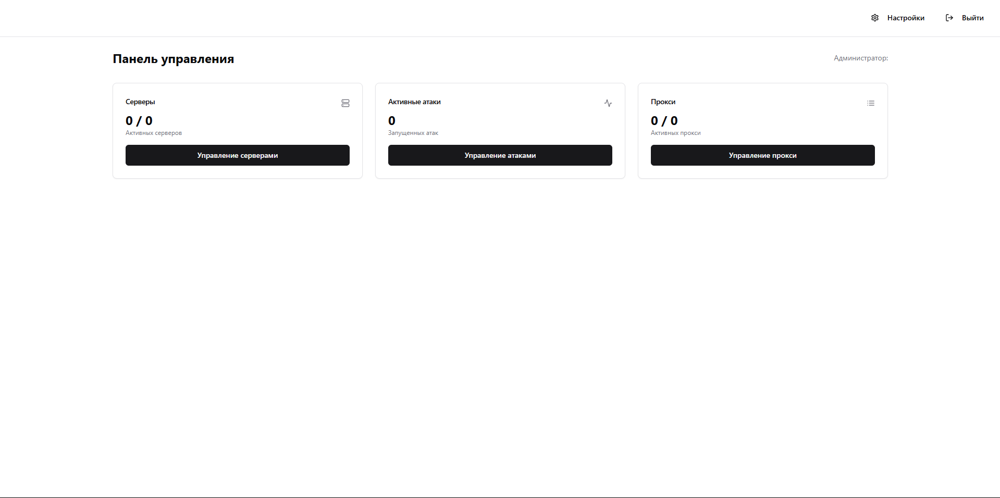

# DDoS Control Panel | Панель управления DDoS

**🌐 [English] | [Русский]**

> 🚧 Coming soon: Multilanguage support and custom language packs will be added in future updates!
> 
> 🚧 Скоро: Поддержка мультиязычности и пользовательских языковых пакетов будет добавлена в будущих обновлениях!

---

# 🎯 Панель управления DDoS

Панель управления для стресс-тестирования ваших собственных проектов. Этот инструмент разработан **строго в образовательных целях и для тестирования устойчивости вашей собственной инфраструктуры**.

## 📋 Возможности

- ✅ Управление серверами для распределенного стресс-тестирования
- ✅ Настройка атак с множеством параметров
- ✅ Поддержка прокси и автоматическая валидация
- ✅ Мониторинг в реальном времени через WebSocket
- ✅ Удобный интерфейс

## ⚠️ Отказ от ответственности

Этот инструмент предоставляется **исключительно в образовательных целях**. Автор не одобряет и не продвигает незаконную деятельность. Используйте этот инструмент только на инфраструктуре, которой вы владеете или имеете явное разрешение на тестирование.

## 🚀 Установка

1. Клонируйте репозиторий:
```bash
git clone https://github.com/DarkPyDoor/DDoS-Control-Panel.git
cd DDoS-Control-Panel
```

2. Запустите скрипт установки:
```bash
chmod +x install.sh
./install.sh
```

3. Запустите приложение:
```bash
npm start
```

4. Вход в панель:
```
Login: admin
Password: admin
```

## 🛠️ Использование

1. Откройте панель по адресу `http://ваш-ip-сервера:5000`
2. Добавьте ваши серверы (с доступом по SSH)
3. Настройте и управляйте прокси
4. Создайте конфигурации тестовых атак
5. Отслеживайте результаты

## 🔧 Технологии

- Backend: Node.js, Express
- Frontend: React, TailwindCSS
- Движок атак: [Проект MHDDoS](https://github.com/MatrixTM/MHDDoS)



## 🤝 Вклад в развитие

Если вы нашли ошибки или у вас есть предложения по улучшению, пожалуйста, откройте issue на GitHub. Я делал этот проект за пару часов, поэтому в нем могут быть некоторые недоработки, которые требуют исправления.

---

Если вам нравится "Панель управления DDoS", пожалуйста, купите мне пару конфеток через Binance Pay: ID 438 485 773 🍬
